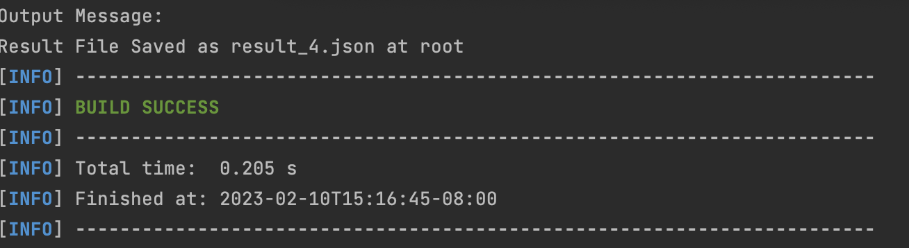
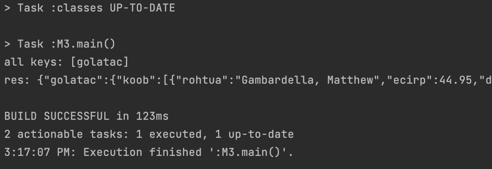

# Milestone3

### Parse() and toJSONObject() methods are added in src/main/java/org.json/XML.java
JSONObject toJSONObject(Reader reader, Function<String,String> func) [line 741]
* Rewrite toJSONObject() method, inputs are a reader and a lambda function  
* Purpose: Add a prefix to all of its keys
* Main method:  
  * Rewrite Parse() [line 1566]. Compared with original parse(), replace string and tagName variable with keyTransformer.apply(string) and keyTransformer.apply(tagName)  
  * Call the new Parse() method in toJSONObject(), put reader and func as input

### Unit Tests are added in src/test/java/org.json.junit/XMLTest.java
We wrote five tests for testing Milestone 3.  
<pre>
1. testM3()                        //add "SWE262_" to every keys as prefix
2. testM3Reverse()                 //reverse the key names
3. testM3WithEmptyString()         //throws exception: "Invalid: transform key to empty string" 
4. testM3WithNull()                //throws exception: "Invalid: transform key to null"
5. testM3WithDuplicateKeyName()    //throws exception: "Invalid: transform key to all the same string"
</pre>
Run "mvn clean test -Dtest=XMLTest" to test XMLTest.java  

### Performance Comparison  

running time: in-library = 123 ms; 
outside = 205 ms 
The efficiency increased by 40%.

  

 
